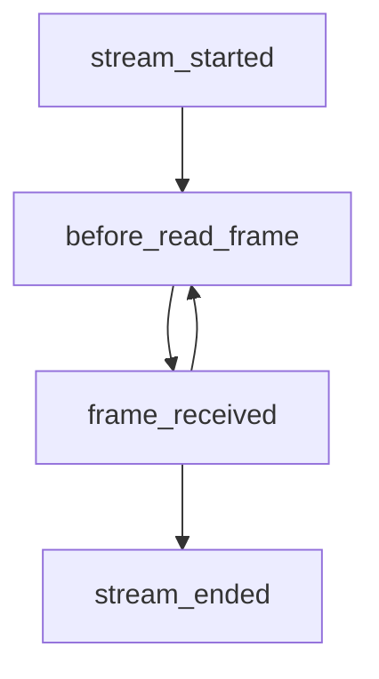

# Frame Manager

The Video Stream library uses OpenCV to read from various sources of video such as webcams, videos, or RTSP streams.

An example of the implementation can be found [here](https://github.com/Tlaloc-Es/aipose/blob/master/aipose/stream/__init__.py).

## Video Stream Lifecycle

To perform actions with a pose estimator, you need to build or call a `FrameManagerBase`.

When a video is being processed, there are three events that can be managed using a [`FrameManagerBase`](https://github.com/Tlaloc-Es/aipose/blob/master/aipose/frame/frame_manager_base.py):

- **stream_started**: This event is triggered when the video stream starts.
- **before_read_frame**: This event is triggered before a frame is read from the video stream.
- **frame_received**: This event is triggered for each frame read from the video stream.
- **stream_ended**: This event is triggered when the video stream ends.

You can use these events to perform various actions such as initializing variables, preprocessing the frame, running inference, and displaying the result.

### Lifecycle Flowchart

